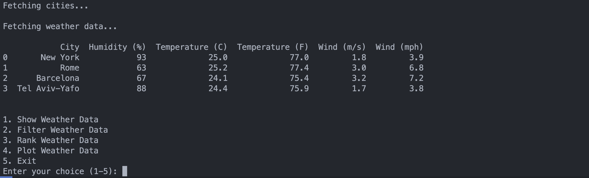
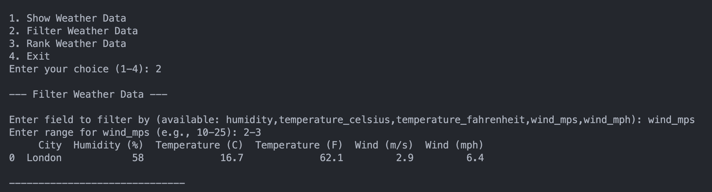
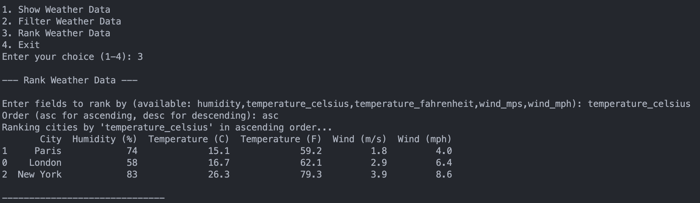

# Singular - Weather Data Scrapper

- [Overview](#overview)
- [Instructions](#instructions)
  - [Requirements](#requirements)
  - [Setup](#setup)
  - [Usage](#usage)

## Overview

This is a Python CLI application that allows the user to fetch weather data from several cities using the Open Meteo API. The application loads the data in a [Pandas Data Frame](https://pandas.pydata.org/docs/reference/api/pandas.DataFrame.html) and displays the results in a user-friendly format. The application also allows the user to filter and rank the data based on specific criteria. Finally, the application exports the results to a CSV file.

## Instructions

### Requirements
- Python 3.12 or higher
- [uv](https://docs.astral.sh/uv/)
- [Open Meteo API URL](https://open-meteo.com/en/docs)
- [Ninja City API Token](https://www.api-ninjas.com/api/city)

### Setup
1. Sync the project dependencies by running the following command in the root directory of the project:
```bash
uv sync
```

2. Go to project directory by running the following command:
```bash
cd /packages/weather-scrapper
```

2. Sign up for an [API Ninja](https://www.api-ninjas.com/register) account and get your API Ninja key.

3. Create a `.env` file in the root directory of the project with the following content:
```
OPEN_METEO_API_URL=https://api.open-meteo.com
API_NINJA_CITY_API_URL=https://api.api-ninjas.com/v1/city
API_NINJA_CITY_API_KEY={YOUR_API_NINJA_CITY_API_KEY}
```

### Usage

1. Run the application by running the following command providing a comma-separated list of cities:
```bash
uv run main.py --cities London,Paris,"New York"
```

if `--cities` is not provided, the application will use the default cities. 

You can also run the application with `--help` to see the available options and cities:
```bash
uv run main.py --help
```

2. The application will fetch the weather data from the Open Meteo API and display the results in a user-friendly format. Then the program will prompt you to choose an action:



- **Show Weather Data**: This action will display the weather data in a user-friendly format.
- **Filter Weather Data**: This action will allow you to filter the weather data based on specific criteria. You will be prompted to enter the field to filter by and the range of values to filter. The application will then display the filtered data.


- **Rank Weather Data**: This action will allow you to rank the weather data based on specific criteria. You will be prompted to enter the fields to rank by and the order (ascending or descending). The application will then display the ranked data.

- **Exit**: This action will exit the application.

Csv file will be created in the `output` directory.